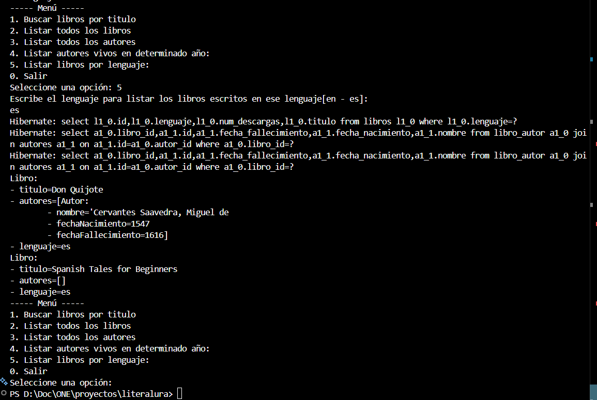

# 📚 Literalura — Catálogo de Libros

## 🧾 Descripción del proyecto

**Literalura** es una aplicación desarrollada con **Spring Boot** que permite buscar libros desde una API externa, guardarlos en una base de datos y consultarlos mediante diferentes filtros.

El sistema consume información de libros, la deserializa y la almacena usando JPA, permitiendo posteriormente realizar consultas personalizadas.

---

## ⚙️ Funcionalidades principales

### 🔎 Buscar libros por título

* Permite consultar una API externa ingresando el nombre de un libro.
* Los resultados se guardan en la base de datos.
  
  

### 📚 Listar libros registrados

* Muestra todos los libros almacenados localmente.

  
  
  
### ✍️ Listar autores registrados

* Permite visualizar los autores guardados en la base de datos.

  
  

### 📅 Listar autores vivos en un año específico

* Filtra autores según el año ingresado por el usuario.
  
  
  

### 🌎 Listar libros por idioma

* Permite buscar libros según el idioma en el que fueron escritos.
* Esta funcionalidad utiliza **Derived Queries** de Spring Data JPA.
  
  

---

## 🛠️ Tecnologías utilizadas

* Java
* Spring Boot
* Spring Data JPA
* Hibernate
* API REST (consumo externo)
* Jackson (deserialización JSON)
* Base de datos relacional

---

## 🧠 Conceptos aplicados

* Consumo de API REST
* Deserialización de datos JSON
* Persistencia con JPA
* Relaciones entre entidades
* Derived Queries en repositorios
* Manejo de excepciones
* Arquitectura por capas

---

## 🚀 Cómo ejecutar el proyecto

1. Clonar el repositorio
2. Abrir el proyecto en VS Code o IntelliJ
3. Configurar la base de datos en `application.properties`
4. Ejecutar la clase principal:

```
LiteraluraApplication.java
```

---

## 📌 Ejemplo de uso

El sistema muestra un menú en consola donde el usuario puede:

* Buscar libros por título
* Ver libros registrados
* Filtrar autores por año
* Filtrar libros por idioma

---

## 🎯 Objetivo del proyecto

Este proyecto fue desarrollado con fines de aprendizaje para reforzar conocimientos en:

* Spring Boot
* Consumo de APIs
* Persistencia de datos
* Consultas derivadas en JPA

---

## 👩‍💻 Autor

Proyecto desarrollado por **Garlet Quispe** como parte de la práctica de aprendizaje en desarrollo backend con Java y Spring Boot.

